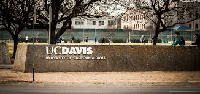

 

Welcome to the industry day on Blockchains and Distributed Ledger Technologies (DLTs) @ [ACM Middleware](http://2019.middleware-conference.org/), on December 8th, 2019 in Davis, USA! The event is hosted at the [University of California, Davis](https://www.ucdavis.edu/).

## Objectives

The objective of this one-day event is to discuss the state-of-the-art in the industrial and commercial deployment of blockchain systems and DLTs. Furthermore, this event will also examine the latest innovations in blockchain research, and challenges to address in order to improve the usability and adoption of blockchains.

The event is designed primarily for an audience of industrial participants who are invested in the blockchain technologies. The event will feature a combination of ***industry keynotes*** and talks, as well as ***discussion panels***. Furthermore, the talks will range from applications and experiences using DLTs to theoretical, technical, and system-oriented topics.

## Call for participation
We are soliciting participants to present their work at the event. We are 
looking for (but are not limited to) the following types of talks:

1. Presentation of **novel industrial use cases**
2. **Adoption roadmap**, technical and non-technical barriers
3. **System** research and development
4. **Vision/blue-sky** topics or position papers
5. Other **industrial** aspects (e.g. mining, exchanges, ...)

## Topics (not limited to this list)
1. Cryptography mechanisms for blockchains
2. Application domains for blockchains (e.g., eHealth, IoT, supply chains, real estate, etc.)
3. Scalability and performance of blockchain systems
4. Security, privacy, and trust in blockchains
5. Consensus mechanisms (e.g., Proof-of-work, Proof-of-stake, PBFT, Merkle DAG, etc.)
6. On-going research in popular blockchain systems (e.g. Ethereum, Hyperledger, etc.)
7. Layer 2 and off-chain solutions (e.g., State channels, Plasma)
8. Smart contract languages, modeling, and verification
9. Theory, cryptoeconomy, and attacks of blockchain systems

## Organisation
Chair: [Kaiwen Zhang](https://fuseelab.github.io/), [École de technologie supérieure](https://www.etsmtl.ca/Bottin/ETS/MotCle/FicheEmploye?Numero=6866), Montréal (Canada)

### Steering committee
- [Robbert van Renesse](https://www.cs.cornell.edu/home/rvr/), [Cornell University](https://www.cornell.edu/), Ithaca (USA)
- [Chandrasekaran Mohan](https://researcher.watson.ibm.com/researcher/view.php?person=us-cmohan), [IBM Almaden Research Center](http://almaden.ibm.com/almaden/welcome.html), San Jose (USA)
- [Sonia Ben Mokhtar](https://sites.google.com/site/soniabm/), [Centre national de la recherche scientifique (CNRS)](https://liris.cnrs.fr/), Lyon (France)

## Submission Information
Please submit an abstract and speaker biography to the event chair: [kaiwen.zhang@etsmtl.ca](mailto:kaiwen.zhang@etsmtl.ca). 
The submission deadline is: **August 31st, 2019**.
